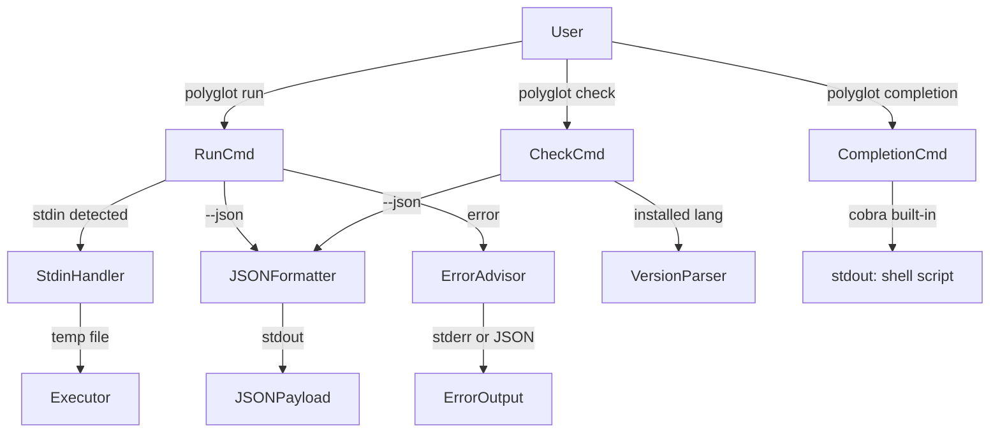

# Design Document: v1.1.0 UX Polish

## Overview

Polyglot v1.1.0 adds five targeted UX improvements to the existing Go CLI tool. Each feature is additive — no existing behaviour is removed or broken. The changes touch four layers: the CLI surface (`internal/cli`), a new stdin handler, a new JSON formatter, an error advisor, and an extension to the check command's version probing.

The module path is `github.com/velo4705/polyglot`. The CLI framework is Cobra v1.8.0.

---

## Architecture

The five features map cleanly onto the existing package structure:

```
internal/
  cli/
    completion.go     ← NEW  (Feature 1)
    run.go            ← MODIFIED (Features 2, 3, 4)
    check.go          ← MODIFIED (Features 3, 5)
  stdin/
    handler.go        ← NEW  (Feature 2)
  output/
    json.go           ← NEW  (Feature 3)
  errors/
    advisor.go        ← NEW  (Feature 4)
  version/
    parser.go         ← NEW  (Feature 5)
```

No new external dependencies are required. All five features use only the Go standard library plus the already-imported Cobra and `os/exec` packages.



---

## Components and Interfaces

### 1. Completion_Generator (`internal/cli/completion.go`)

Wraps Cobra's built-in completion generators. No custom logic needed beyond routing the positional argument.

```go
// completionCmd routes to Cobra's built-in generators.
// Supported shells: bash, zsh, fish
var completionCmd = &cobra.Command{
    Use:   "completion [bash|zsh|fish]",
    Short: "Generate shell completion scripts",
    Long:  completionLong, // includes per-shell install instructions
    Args:  cobra.ExactArgs(1),
    RunE:  generateCompletion,
}

func generateCompletion(cmd *cobra.Command, args []string) error
```

Delegates to `rootCmd.GenBashCompletion(os.Stdout)`, `rootCmd.GenZshCompletion(os.Stdout)`, or `rootCmd.GenFishCompletion(os.Stdout, true)`. Returns an error for any other shell name.

### 2. Stdin_Handler (`internal/stdin/handler.go`)

Reads all bytes from `os.Stdin`, writes them to a temp file with the correct extension, and returns the path. Cleanup is the caller's responsibility via `defer`.

```go
// CanonicalExtension returns the primary file extension for a language name.
func CanonicalExtension(langName string) (string, bool)

// ReadToTempFile reads stdin and writes it to a temp file.
// Returns the temp file path. Caller must os.Remove the path when done.
func ReadToTempFile(langName string) (string, error)
```

`CanonicalExtension` is a simple map from language name → extension (e.g. `"Python"` → `".py"`). It covers all 30 languages in `pkg/types/types.go`.

### 3. JSON_Formatter (`internal/output/json.go`)

Serialises run and check results to JSON using `encoding/json`.

```go
// RunResult is the JSON payload for `polyglot run --json`.
type RunResult struct {
    Language   string `json:"language"`
    File       string `json:"file"`
    ExitCode   int    `json:"exit_code"`
    Stdout     string `json:"stdout"`
    Stderr     string `json:"stderr"`
    DurationMs int64  `json:"duration_ms"`
}

// CheckEntry is one element of the `languages` array.
type CheckEntry struct {
    Language  string `json:"language"`
    Installed bool   `json:"installed"`
    Version   string `json:"version"`
}

// CheckResult is the JSON payload for `polyglot check --json`.
type CheckResult struct {
    Languages []CheckEntry `json:"languages"`
}

// PrintRun serialises r and writes it to w (normally os.Stdout).
func PrintRun(w io.Writer, r RunResult) error

// PrintCheck serialises r and writes it to w.
func PrintCheck(w io.Writer, r CheckResult) error
```

When `--json` is active, `run.go` captures stdout/stderr from the executor into `bytes.Buffer` values instead of streaming them, then calls `PrintRun`. The `check.go` command builds a `CheckResult` slice and calls `PrintCheck`.

### 4. Error_Advisor (`internal/errors/advisor.go`)

Maps low-level errors to actionable messages. Called from `run.go` and `check.go` instead of `ui.Error`.

```go
// executableToLanguage maps runtime binary names to Polyglot language names.
var executableToLanguage = map[string]string{
    "python3": "python",
    "node":    "javascript",
    "ruby":    "ruby",
    "go":      "go",
    "java":    "java",
    "rustc":   "rust",
    // ... all other supported executables
}

// NotFound returns the actionable message for a missing runtime.
func NotFound(langName string) string

// FileNotFound returns the actionable message for a missing file.
func FileNotFound(path string) string

// UnknownExtension returns the actionable message for an unrecognised extension.
func UnknownExtension(ext string, supported []string) string

// Generic wraps an arbitrary error with a context prefix.
func Generic(context string, err error) string

// IsNotFoundError inspects an error and returns the executable name if it is
// an "executable not found" error (exec.ErrNotFound or "no such file").
func IsNotFoundError(err error) (executable string, ok bool)
```

### 5. Version_Parser (`internal/version/parser.go`)

Runs the version command for a language and extracts the version string.

```go
// VersionSpec describes how to obtain and parse a version for one language.
type VersionSpec struct {
    Command string   // e.g. "python3"
    Args    []string // e.g. ["--version"]
    // ParseFn extracts the version string from combined stdout+stderr output.
    ParseFn func(output string) string
}

// Specs is the registry of per-language version specs.
var Specs map[string]VersionSpec

// Get runs the version command for langName and returns the version string.
// Returns ("", false) if the language is not installed or the version cannot be parsed.
// Returns ("unknown", true) if installed but output is unparseable.
func Get(langName string) (version string, installed bool)
```

Per-language parse functions use `regexp` or simple string splitting. Examples:

| Language | Command | Parse strategy |
|----------|---------|----------------|
| Python | `python3 --version` | Split on space, take last token |
| Node.js | `node --version` | Trim leading `v` |
| Go | `go version` | Split on space, take 3rd token, trim `go` prefix |
| Ruby | `ruby --version` | Split on space, take 2nd token |
| Java | `java --version` | First line, split on space, take 2nd token |
| Rust | `rustc --version` | Split on space, take 2nd token |
| All others | `<cmd> --version` or `<cmd> version` | First non-empty line, first token matching `\d+\.\d+` |

---

## Data Models

### RunResult (JSON output for `run`)

```json
{
  "language":    "Python",
  "file":        "hello.py",
  "exit_code":   0,
  "stdout":      "Hello, world!\n",
  "stderr":      "",
  "duration_ms": 142
}
```

### CheckResult (JSON output for `check`)

```json
{
  "languages": [
    { "language": "Python",     "installed": true,  "version": "3.12.3" },
    { "language": "JavaScript", "installed": true,  "version": "20.11.0" },
    { "language": "Rust",       "installed": false, "version": "" }
  ]
}
```

### Stdin temp file naming

Temp files are created with `os.CreateTemp("", "polyglot-stdin-*<ext>")`. The `*` is replaced by a random suffix by the OS, ensuring no collisions. The extension is appended after the suffix so the detector can identify the language.

---

## Correctness Properties

*A property is a characteristic or behavior that should hold true across all valid executions of a system — essentially, a formal statement about what the system should do. Properties serve as the bridge between human-readable specifications and machine-verifiable correctness guarantees.*

### Property 1: Completion output contains shell-specific markers

*For any* supported shell name (`bash`, `zsh`, `fish`), the bytes written to stdout by the completion command must contain the shell-specific marker string that identifies a valid completion script for that shell (`complete -F` for bash, `#compdef` for zsh, `complete -c polyglot` for fish).

**Validates: Requirements 1.2, 1.3, 1.4**

---

### Property 2: Stdin temp file round-trip

*For any* supported language name and any byte sequence read from stdin, the temp file created by `ReadToTempFile` must contain exactly those bytes and its path must end with the canonical extension for that language.

**Validates: Requirements 2.1, 2.2**

---

### Property 3: Temp file cleanup invariant

*For any* execution path through the stdin handler (success, error, or interrupt), the temp file path returned by `ReadToTempFile` must not exist on disk after the run command returns.

**Validates: Requirements 2.4**

---

### Property 4: Run JSON output structure

*For any* invocation of `polyglot run --json`, the bytes written to stdout must parse as valid JSON and the resulting object must contain all six required fields (`language`, `file`, `exit_code`, `stdout`, `stderr`, `duration_ms`) with the correct types.

**Validates: Requirements 3.2, 3.7**

---

### Property 5: Check JSON output structure

*For any* invocation of `polyglot check --json`, the bytes written to stdout must parse as valid JSON and the resulting object must contain a `languages` array where every element has `language` (string), `installed` (boolean), and `version` (string).

**Validates: Requirements 3.3, 5.7**

---

### Property 6: JSON error encoding

*For any* error condition encountered while `--json` is active, the `exit_code` field in the JSON output must be non-zero and the `stderr` field must contain a non-empty error description; no plain-text error must appear on stdout.

**Validates: Requirements 3.4, 4.6**

---

### Property 7: Missing runtime error message format

*For any* language whose runtime executable is not on PATH, the error message produced by `ErrorAdvisor.NotFound` must match the format `<Language> is not installed. Run: polyglot install <language>`.

**Validates: Requirements 4.1**

---

### Property 8: File-not-found error message format

*For any* file path that does not exist, the error message produced by `ErrorAdvisor.FileNotFound` must match the format `File not found: <path>. Check the path and try again.`

**Validates: Requirements 4.2**

---

### Property 9: Unknown extension error message format

*For any* file extension not recognised by the detector, the error message produced by `ErrorAdvisor.UnknownExtension` must mention the supported extensions list and the `--lang` flag.

**Validates: Requirements 4.3**

---

### Property 10: Executable-to-language mapping completeness

*For any* executable name in the mapping table defined by Requirement 4.5 (`python3`, `node`, `ruby`, `go`, `java`, `rustc`, and all other supported executables), `executableToLanguage[exe]` must return the correct canonical Polyglot language name.

**Validates: Requirements 4.5**

---

### Property 11: Version parser returns non-empty string for known output

*For any* language in the supported set and its known version command output format, `version.Get` must return a non-empty, non-`"unknown"` version string when the runtime is installed and the output matches the expected format.

**Validates: Requirements 5.1, 5.2, 5.6**

---

## Error Handling

| Scenario | Component | Behaviour |
|----------|-----------|-----------|
| Unsupported shell in `completion` | `completion.go` | `ui.Error` + list supported shells + `os.Exit(1)` |
| Stdin piped without `--lang` | `run.go` | `ui.Error("--lang is required when reading from stdin")` + exit 1 |
| Temp file write failure | `stdin.ReadToTempFile` | Return error; caller prints via `ErrorAdvisor.Generic` |
| Runtime not on PATH | `errors.IsNotFoundError` + `ErrorAdvisor.NotFound` | Actionable install hint |
| File does not exist | `run.go` pre-check | `ErrorAdvisor.FileNotFound` |
| Unknown extension | `detector` error path | `ErrorAdvisor.UnknownExtension` |
| Version command fails | `version.Get` | Returns `("unknown", true)` — check displays `INSTALLED (version unknown)` |
| `--json` + any error | `output.PrintRun` | Error encoded in `stderr` field; `exit_code` non-zero |

All errors that reach the user while `--json` is active are routed through `output.PrintRun` or `output.PrintCheck` rather than `ui.Error`, satisfying Requirement 3.5.

---

## Testing Strategy

### Dual approach

Both unit tests and property-based tests are used. Unit tests cover specific examples, integration points, and error conditions. Property tests verify universal invariants across randomised inputs.

The property-based testing library is **[`pgregory.net/rapid`](https://github.com/flyingmutant/rapid)** — a pure-Go PBT library with no external dependencies, well-suited for CLI tools. Each property test runs a minimum of **100 iterations**.

Each property test is tagged with a comment in the format:
```
// Feature: v1-1-ux-polish, Property <N>: <property text>
```

### Unit tests

| File | What is tested |
|------|---------------|
| `internal/cli/completion_test.go` | Unsupported shell returns error (Req 1.5); help text contains install instructions (Req 1.6) |
| `internal/cli/run_test.go` | `--lang` required with stdin (Req 2.5); `--json` + `--quiet` precedence (Req 3.6); flag registration (Req 3.1) |
| `internal/cli/check_test.go` | NOT FOUND row has no version (Req 5.4) |
| `internal/errors/advisor_test.go` | Generic error wrapping (Req 4.4) |

### Property tests

Each correctness property maps to exactly one property-based test:

| Test file | Property | rapid generators used |
|-----------|----------|-----------------------|
| `internal/cli/completion_test.go` | Property 1 | `rapid.SampledFrom([]string{"bash","zsh","fish"})` |
| `internal/stdin/handler_test.go` | Property 2 | `rapid.SliceOf(rapid.Byte())`, `rapid.SampledFrom(supportedLangs)` |
| `internal/stdin/handler_test.go` | Property 3 | same generators + simulated error injection |
| `internal/output/json_test.go` | Property 4 | `rapid.String()`, `rapid.Int()` for all fields |
| `internal/output/json_test.go` | Property 5 | `rapid.SliceOf(checkEntryGen)` |
| `internal/output/json_test.go` | Property 6 | `rapid.String()` for error messages, `rapid.IntRange(1,255)` for exit codes |
| `internal/errors/advisor_test.go` | Property 7 | `rapid.SampledFrom(supportedLangs)` |
| `internal/errors/advisor_test.go` | Property 8 | `rapid.String()` for file paths |
| `internal/errors/advisor_test.go` | Property 9 | `rapid.String()` filtered to unknown extensions |
| `internal/errors/advisor_test.go` | Property 10 | `rapid.SampledFrom(executableNames)` |
| `internal/version/parser_test.go` | Property 11 | `rapid.SampledFrom(supportedLangs)` with fixture outputs |
